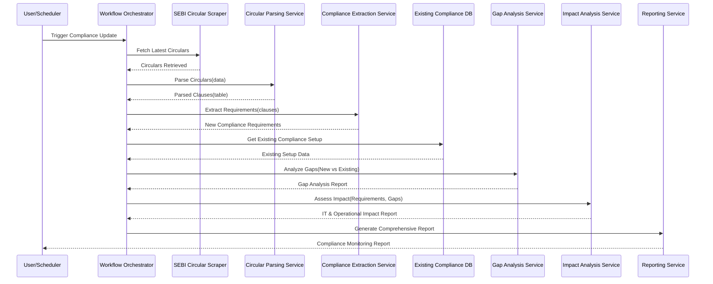
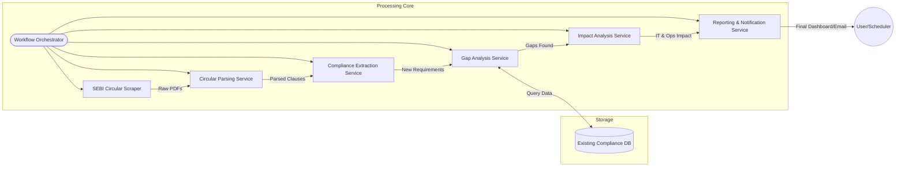

# SEBI Compliance Architecture Blueprints

## 1. System Execution Pipeline

```mermaid
sequenceDiagram
    participant User as User/Scheduler
    participant Orchestrator as Workflow Orchestrator
    participant Scraper as SEBI Circular Scraper
    participant Parser as Circular Parsing Service
    participant Extractor as Compliance Extraction Service
    participant DB as Existing Compliance DB
    participant Gap as Gap Analysis Service
    participant Impact as Impact Analysis Service
    participant Reporter as Reporting Service

    User->>Orchestrator: Trigger Compliance Update
    Orchestrator->>Scraper: Fetch Latest Circulars
    Scraper-->>Orchestrator: Circulars Retrieved
    Orchestrator->>Parser: Parse Circulars(data)
    Parser-->>Orchestrator: Parsed Clauses(table)
    Orchestrator->>Extractor: Extract Requirements(clauses)
    Extractor-->>Orchestrator: New Compliance Requirements
    Orchestrator->>DB: Get Existing Compliance Setup
    DB-->>Orchestrator: Existing Setup Data
    Orchestrator->>Gap: Analyze Gaps(New vs Existing)
    Gap-->>Orchestrator: Gap Analysis Report
    Orchestrator->>Impact: Assess Impact(Requirements, Gaps)
    Impact-->>Orchestrator: IT & Operational Impact Report
    Orchestrator->>Reporter: Generate Comprehensive Report
    Reporter-->>User: Compliance Monitoring Report
```

## 2. Component Boundaries

```mermaid
flowchart LR
    subgraph Storage
        ComplianceDB[(Existing Compliance DB)]
    end

    subgraph Processing Core
        Orchestrator([Workflow Orchestrator])
        Scraper[SEBI Circular Scraper]
        Parser[Circular Parsing Service]
        Extractor[Compliance Extraction Service]
        GapAnalyzer[Gap Analysis Service]
        ImpactAnalyzer[Impact Analysis Service]
        Reporter[Reporting & Notification Service]
    end

    Orchestrator --> Scraper
    Orchestrator --> Parser
    Orchestrator --> Extractor
    Orchestrator --> GapAnalyzer
    Orchestrator --> ImpactAnalyzer
    Orchestrator --> Reporter

    Scraper -->|Raw PDFs| Parser
    Parser -->|Parsed Clauses| Extractor
    Extractor -->|New Requirements| GapAnalyzer
    GapAnalyzer <-->|Query Data| ComplianceDB
    GapAnalyzer -->|Gaps Found| ImpactAnalyzer
    ImpactAnalyzer -->|IT & Ops Impact| Reporter
    Reporter -->|Final Dashboard/Email| User((User/Scheduler))
```